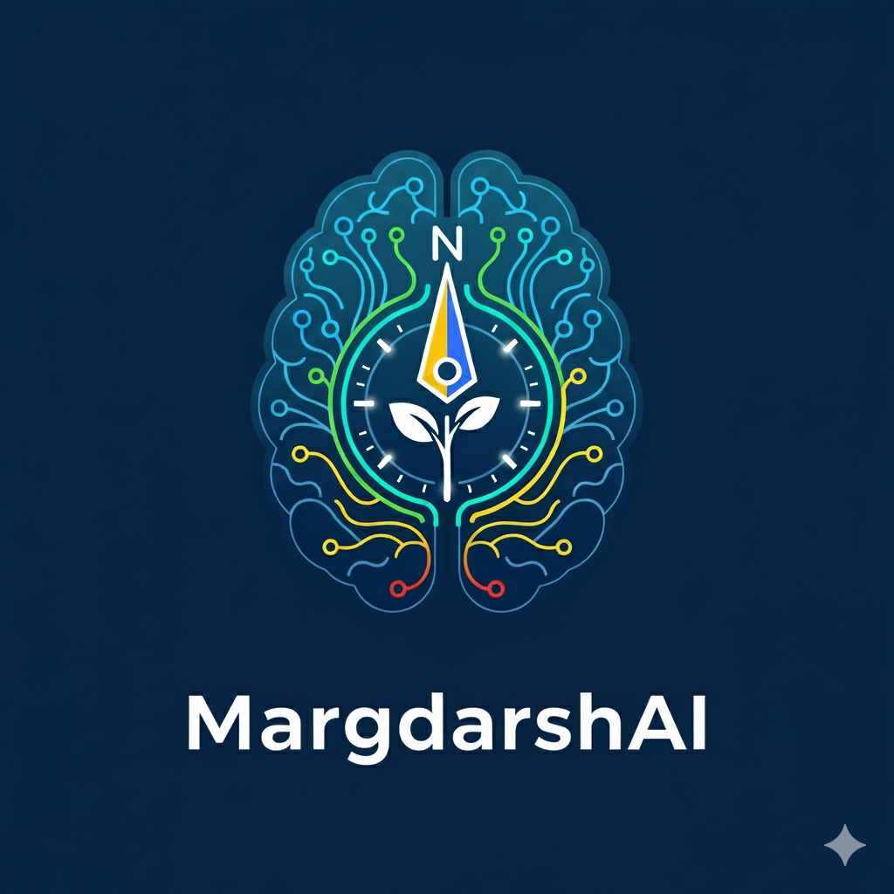

# MargdarshAI - Personalized Career & Skills Advisor




Welcome to **MargdarshAI**, a web application designed to provide personalized career and skills guidance. Built with a modern tech stack, this platform helps users discover career paths tailored to their academic background, interests, and aspirations.

## ✨ Key Features

- **🔐 Secure Authentication**: Sign up and sign in using your email and password or with a single click via your Google account.
- **👤 User Profile**: A dedicated profile section for users to manage their personal and academic details.
- **🚀 Personalized Guidance**: The core of MargdarshAI. Users input their subjects, skills, and interests to receive tailored career recommendations.
- **🗺️ Career Blueprints**: Each recommendation comes with a detailed blueprint, including:
  - Skill Gap Analysis
  - A list of required skills to break into the field.
  - Curated learning resources.
  - Project and internship ideas to build practical experience.
- **🤖 Interactive Chat (Demo)**: A chat interface to interact with the AI for further clarification.
- **📄 Export to PDF**: Users can export their generated career paths to a PDF for offline access.
- **🎨 Dark Mode UI**: A sleek, modern, and fully dark-themed user interface.

## 🛠️ Tech Stack

- **Framework**: [Next.js](https://nextjs.org/)
- **Styling**: [Tailwind CSS](https://tailwindcss.com/)
- **UI Components**: [Shadcn UI](https://ui.shadcn.com/)
- **Authentication**: [better-auth](https://better-auth.dev/)
- **Database & ORM**: [Drizzle ORM](https://orm.drizzle.team/) with [Turso](https://turso.tech/)/[libSQL](https://github.com/tursodatabase/libsql)
- **Deployment**: [Vercel](https://vercel.com/)

## 🚀 Getting Started

Follow these instructions to get a copy of the project up and running on your local machine for development and testing purposes.

### Prerequisites

- [Node.js](https://nodejs.org/en) (v18 or later)
- [Bun](https://bun.sh/) (or npm/yarn)

### Installation

1.  **Clone the repository:**

    ```bash
    git clone https://github.com/harshil748/GEN-AI.git
    cd GEN-AI
    ```

2.  **Install dependencies:**

    ```bash
    bun install
    ```

3.  **Set up environment variables:**
    Create a `.env` file in the root of your project and add the following variables. You will need to get these credentials from the respective services (e.g., Turso for the database, Google Cloud for OAuth).

    ```env
    # Site URL
    NEXT_PUBLIC_SITE_URL="http://localhost:3000"

    # Database (Turso)
    DATABASE_URL="your-turso-database-url"
    DATABASE_AUTH_TOKEN="your-turso-auth-token"

    # better-auth secrets
    AUTH_SECRET="a-secure-random-string-of-at-least-32-characters"
    GOOGLE_CLIENT_ID="your-google-client-id"
    GOOGLE_CLIENT_SECRET="your-google-client-secret"
    ```

4.  **Run database migrations:**
    Apply the database schema to your Turso database.

    ```bash
    bunx drizzle-kit push
    ```

5.  **Run the development server:**
    ```bash
    bun run dev
    ```

Open [http://localhost:3000](http://localhost:3000) with your browser to see the result.
